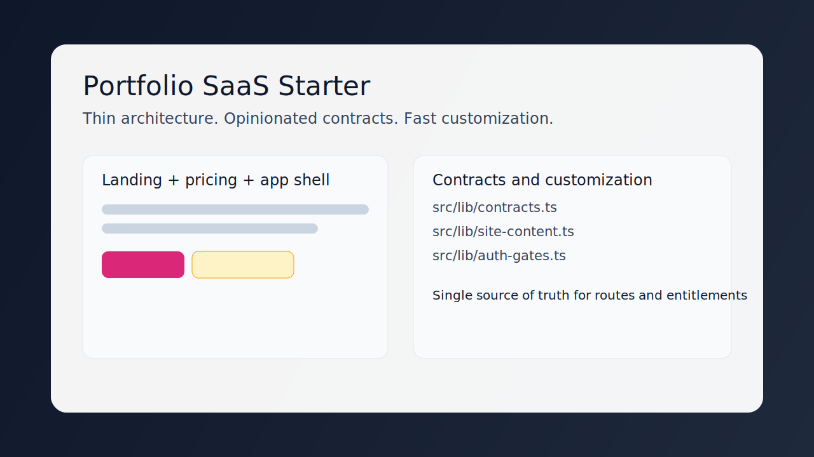
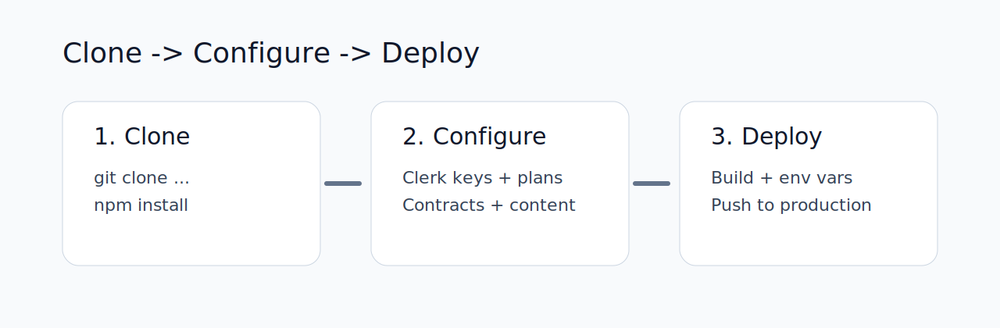
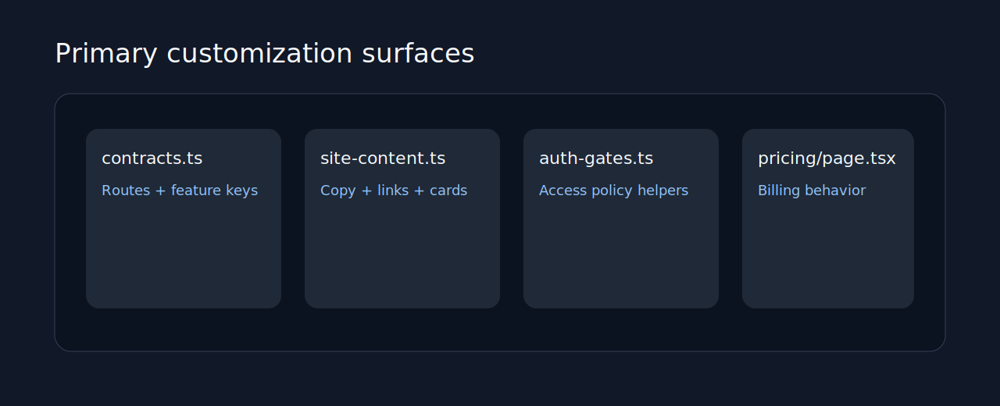

# Portfolio SaaS Starter

Free, configurable SaaS starter template for teams that want to clone, configure, and deploy quickly with clear contracts and minimal framework overhead.



## What this is

This repository is a thin but opinionated starter built with Next.js and Clerk.  
It gives you a working baseline for:

- Landing page and conversion-focused entry points
- Authentication shell
- Pricing and billing surface
- Feature-gated app area
- Centralized contracts for routes and entitlements

## Who this is for

Use this template if you want to:

- Ship an MVP quickly without building auth/billing scaffolding from scratch
- Keep business logic readable and auditable
- Customize product copy, links, and gated features from a few central files

Skip this template if you need:

- A full backend/domain architecture already included
- A monorepo with many apps and services on day one

## Product flow



1. Clone the repository.
2. Configure Clerk and environment variables.
3. Customize contracts and content.
4. Deploy.

## Quickstart

```bash
git clone https://github.com/yaz-devcodes/portfolio-saas.git
cd portfolio-saas
npm install
npm run dev
```

Open `http://localhost:3000`.

## Configuration checklist

1. Create a Clerk application.
2. Add Clerk keys to `.env.local`.
3. Configure pricing plans and feature entitlements in Clerk.
4. Confirm feature keys in `src/lib/contracts.ts`.
5. Confirm content/cards in `src/lib/site-content.ts`.

## Architecture principles

- **Thin:** minimal abstraction, no hidden magic, direct flow from config to UI.
- **Opinionated:** route and entitlement contracts are centralized and explicit.
- **Config-first:** update content and contracts before touching component internals.
- **Drift-resistant:** feature card metadata and gate checks derive from one canonical contract.

## Customize in 10 minutes

Start here before editing UI internals:

- `src/lib/site-content.ts`
  - Update hero text, CTA links, nav links, footer links, and card content.
- `src/lib/contracts.ts`
  - Update route constants and feature entitlement keys.
- `src/lib/auth-gates.ts`
  - Keep access policy aligned with entitlement contracts.
- `src/app/pricing/page.tsx`
  - Adjust pricing table behavior and post-subscription redirect.



## Behavior guarantees

- `/app` requires a signed-in user with `dashboard_access`.
- Missing access redirects to `/pricing`.
- App feature cards and gate checks stay aligned through shared contracts.
- Core shell structure remains consistent through `PageShell`.

## Tech stack

- Next.js (App Router)
- TypeScript
- Clerk (`@clerk/nextjs`)
- Tailwind CSS v4
- Zod
- Shiki

## Scripts

- `npm run dev`: start development server
- `npm run build`: create production build
- `npm run start`: run production build
- `npm run lint`: run ESLint

## Deploy

Deploy to any Node-compatible platform.  
For Vercel, connect the repository, add environment variables, and deploy.

## License

Use this template freely as a starter for your product.
